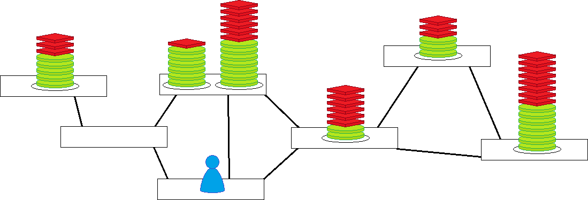
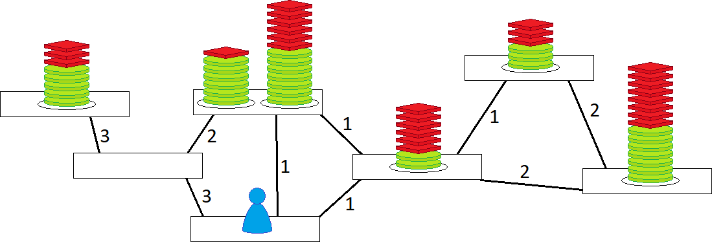

# Schedule Map &middot; [](https://github.com/your/your-project/blob/master/LICENSE)

## Summary

The best way to explain this project is with a game. Look at the following graph:



You play as the blue character. During a turn, you can
- Stay on your current node, or
- Move to a connected node

After each turn, every pile on the board loses a red square token. If you are on a node at the point when it loses its last red token, you gain all the green circle tokens in that pile. If you arrive too early, you'll have to wait until all the red tokens are gone. If you are too late, you get nothing. The goal of the game is to get as many green tokens as possible.

Now, let's make the game harder:



Now, moving across an edge takes the indicated amount of turns. Another way to sat it is whenever you move across an edge, the indicated number of red tokens is taken from every pile on the board.

Now, let's make it harder again:


Now, some piles have yellow pentagonal tokens. In order to get the green tokens from those piles, you have to:
- Be at the node when the last red token is gone
- Stay at the node while the yellow tokens disappears at the same rate as the red tokens i.e. one token per turn

This last game is the type of game that this project is solving.

## How it works

Basically, for every decision that a character makes, they create copies of themself, and sends the copy of on the choice. At the end of each turn, every node compares all the character copies that have arrived at said node. It keeps the copy that has the largest number of tokens, and destroys the rest.

Then, if the node has any piles that have just arrived at the yellow token stage, an extra copy of the character is made to wait at the node for the number of yellow tokens, and is then reintroduced into the mix at the end of the yellow tokens.

## How to use

Consider the following code as a quick example of use
```
new Map<string>(
    new List<string> { "A", "B", "C"},
    new Dictionary<string, Dictionary<string, int>> {
        {"A", new Dictionary<string, int>{ { "B", 1 }}},
        {"B", new Dictionary<string, int>{ { "A", 1 }, { "C", 2 }}},
        {"C", new Dictionary<string, int>{ { "B", 2 }}},
    }).GetRoute(
        new List<ScheduleItem<string>> {
            new ScheduleItem<string>( "A", 5, 8 ),
            new ScheduleItem<string>( "B", 6, 1, 1 ),
            new ScheduleItem<string>( "C", 6, 4, 1 ),
    }, "A", 0, 8
);
```

To instantiate a Schedule Map with each node represented by a class T (in the above case, a string), two things are needed:
- A List of all the T instances that should be represented as a node
- A Dicationary with T instances as keys, and for values, either
    - A List of T instances the T instance is attached to.
    - A Dictinary with the attached T instance as the key and the number of turns it takes to get from one to the other as the value

To get a list of directions (in the form of a Queue of T instances), you use the GetRoute function, with the following inputs:
- A List of ScheduleItems(the token piles), which are instantiated with
    - The T instance that holds the token pile
    - The number of green tokens
    - The number of red tokens
    - The number of yellow tokens, if neccessary
- The T instance that will be the starting node
- How many red tokens should be taken off at the beginning
- How many turns should be planned out